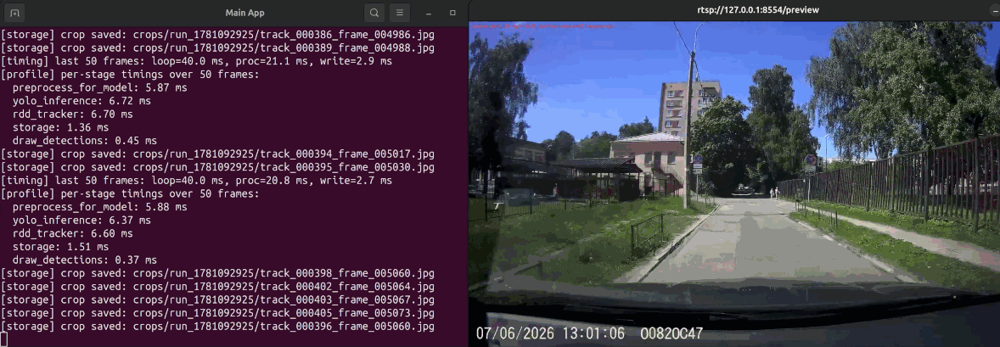
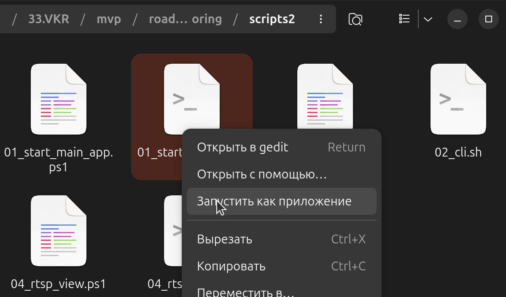
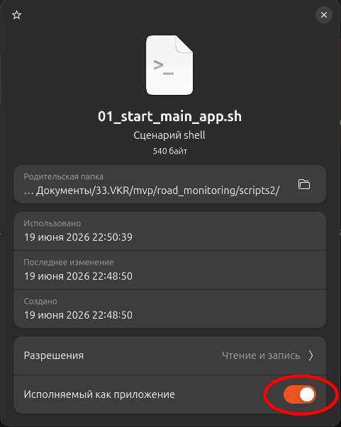
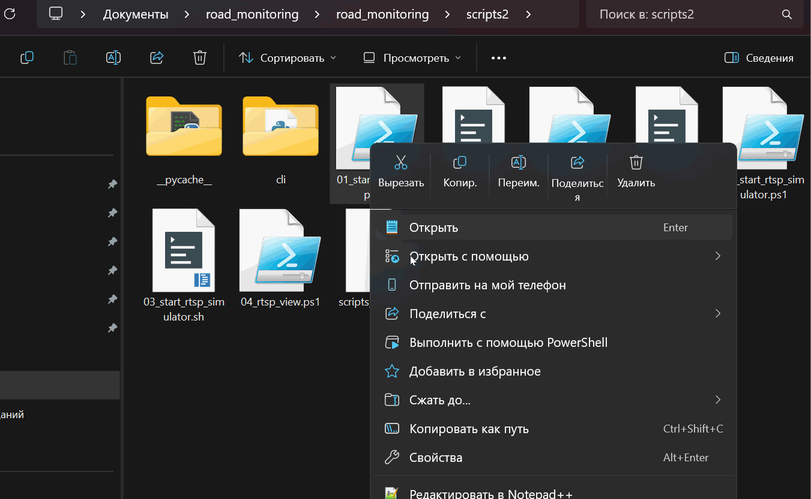

# Детекция дефектов дорожного полотна — MVP

Минимально рабочий прототип сервиса детекции дефектов дорожного полотна с захватом RTSP-видеопотока, трекингом объектов, локальным хранилищем и REST API управления.


---

## Реализованные функции

- Захват входного RTSP-видеопотока (FFmpeg) с автоматическим восстановлением соединения
- Детектирование дефектов моделью YOLO (YOLOv8/v9/v11)
- Трекинг дефектов между кадрами с компенсацией движения камеры (оптический поток Lucas–Kanade)
- Сохранение результатов в локальную SQLite-базу и файловое хранилище кропов
- Трансляция аннотированного выходного RTSP-потока для визуального контроля
- Управление параметрами системы через REST API без перезапуска
- CLI-утилита для настройки и отладки во время работы
- Пакетная обработка директории изображений

---

## Системные зависимости

Перед установкой Python-окружения убедитесь, что в системе установлены и доступны в `PATH` следующие программы.

### Python 3.12

Скачать: [python.org/downloads](https://www.python.org/downloads/)

```bash
$ python3.12 --version
Python 3.12.3
```

### ffmpeg

Используется для захвата входного RTSP-потока и публикации тестового видео симулятором камеры.

Скачать: [ffmpeg.org/download](https://ffmpeg.org/download.html)

```bash
$ ffmpeg -version
ffmpeg version 6.1.1-3ubuntu5 Copyright (c) 2000-2023 the FFmpeg developers
```

### Docker

Используется для запуска RTSP-сервера MediaMTX в контейнере. Сам MediaMTX отдельно ставить не нужно — он поднимается автоматически скриптом `03_start_rtsp_simulator`.

Скачать: [docker.com/products/docker-desktop](https://www.docker.com/products/docker-desktop/)
Справка по MediaMTX: [github.com/bluenviron/mediamtx](https://github.com/bluenviron/mediamtx)

```bash
$ docker --version
Docker version 29.4.0, build 9d7ad9f
```

### NVIDIA-драйвер и CUDA (опционально, для GPU)

Прототип работает и на CPU, но для нормальной производительности рекомендуется GPU с поддержкой CUDA. Версия CUDA подбирается самостоятельно под установленный драйвер; подходящую сборку PyTorch выберете на [pytorch.org/get-started/locally](https://pytorch.org/get-started/locally/).

Скачать драйвер и CUDA Toolkit: [developer.nvidia.com/cuda-downloads](https://developer.nvidia.com/cuda-downloads)

```bash
$ nvidia-smi
+-----------------------------------------------------------------------------------------+
| NVIDIA-SMI 580.159.03             Driver Version: 580.159.03     CUDA Version: 13.0     |
+-----------------------------------------+------------------------+----------------------+
| GPU  Name                 Persistence-M | Bus-Id          Disp.A | Volatile Uncorr. ECC |
|=========================================+========================+======================|
|   0  NVIDIA GeForce RTX 4070 ...    Off |   00000000:01:00.0 Off |                  N/A |
| N/A   43C    P0             15W /  115W |      15MiB /   8188MiB |      9%      Default |
+-----------------------------------------+------------------------+----------------------+
```

### mpv (опционально, для просмотра выходного потока)

Нужен только если планируется использовать скрипт `04_rtsp_view` для просмотра выходного RTSP-потока прототипа. Можно пользоваться любым другим RTSP-плеером (например, VLC) — тогда установка не требуется.

Скачать: [mpv.io/installation](https://mpv.io/installation/)

```bash
$ mpv --version
mpv 0.38.0 Copyright © 2000-2024 mpv/MPlayer/mplayer2 projects
```

---

## Быстрый старт

### 1 Клонировать репозиторий и перейти в ветку vkr

```bash
git clone https://github.com/userGl/road_monitoring
cd road_monitoring
git checkout vkr
```

### 2 Создать и активировать виртуальное окружение

```bash
# Создать
python3.12 -m venv .venv

# Linux
source .venv/bin/activate

# Windows (PowerShell)
.venv\Scripts\activate
```

### 3 Установить PyTorch

Установите PyTorch с нужной версией CUDA по инструкции на [pytorch.org/get-started/locally](https://pytorch.org/get-started/locally/), например:

```bash
pip install torch torchvision --index-url https://download.pytorch.org/whl/cu126
```

### 4 Установить зависимости проекта

```bash
pip install -r requirements.txt
```

### 5 Скачать веса модели и тестовое видео

- Веса модели: ссылка в `models/download_link.md`. Скачанный файл поместите в папку `models/`.
- Тестовое видео: ссылка в `test_videos/download_link.md`. Скачанный файл поместите в папку `test_videos/`.

### 6 Проверки перед запуском

Перед стартом убедитесь:

1. **Веса модели** лежат в папке `models/` по пути, указанному в `config.yaml` (параметр `detector.model_path`, по умолчанию `models/YOLOv8_Small_RDD.pt`).
2. **Тестовый видеофайл** существует по пути, указанному в `scripts2/scripts_config.yaml` (параметр `video`, по умолчанию `test_videos/check1.mkv`).
3. **Адреса RTSP согласованы** между двумя конфигурационными файлами (только если что-то меняли):
   - `scripts2/scripts_config.yaml` — `simulator_host:simulator_port/simulator_path` ↔ `config.yaml` — `stream.input_rtsp_url`
   - `scripts2/scripts_config.yaml` — `output_host:output_port/output_path` ↔ `config.yaml` — `stream.output_rtsp_url`

По умолчанию всё уже согласовано, править эти параметры нужно только при смене портов или путей.

### 7 Запуск прототипа


#### 7.1 Запуск приложения прототипа
##### 7.1.1 Linux
Сделать правый клик по 01_start_main_app.sh в папке scripts2 и  выбрать  "Запустить как приложение":  
  
Возможно предварительно необходимо будет дать права на выполнение скрипта  
  

Можно так же запустить приложение обычным способом выполнив в виртуальном окружении корня проекта:
```bash
python main.py
```
##### 7.1.2 Windows
Сделать правый клик по 01_start_main_app.ps1 в папке scripts2 и  выбрать  "Выполнить с помощью PowerShell":
  

 В Windows так же можно запустить приложение обычным способом выполнив в виртуальном окружении корня проекта:
```bash
python main.py
```


Каждый скрипт запускается в отдельном окне терминала.

### 8. Управление прототипом через CLI

Когда прототип уже работает, для управления параметрами на лету (смена модели, порога уверенности, режима, запуск пакетной обработки) запустите CLI-утилиту:

```bash
# Linux / macOS
bash scripts2/02_cli.sh

# Windows (PowerShell)
.\scripts2\02_cli.ps1
```

Скрипт активирует виртуальное окружение и открывает интерактивное текстовое меню.

---

## Запуск вручную

```bash
# В активированном виртуальном окружении
python main.py
```

После запуска приложение загружает `config.yaml`, запускает REST API сервер на порту `8081` и переходит в основной цикл обработки.

---

## Режимы работы

Переключаются через REST API или CLI-утилиту:

| Режим  | Описание                                         |
| ------ | ------------------------------------------------ |
| `rtsp` | Непрерывная обработка входящего RTSP-видеопотока |
| `idle` | Ожидание команды, обработка приостановлена       |

Пакетная обработка директории с тестовыми изображениями вызывается отдельным вызовом REST API (`POST /api/v1/test/images`) или соответствующим пунктом меню CLI и не является отдельным режимом.

---

## Структура репозитория

```text
road_monitoring/
├── main.py                     # Точка входа в приложение
├── config.yaml                 # Конфигурация прототипа
├── requirements.txt            # Зависимости Python-проекта
├── manual_test.ipynb           # Ноутбук для ручной отладки детекций
│
├── api/
│   └── rest_api.py             # REST API (FastAPI, порт 8081)
│
├── core/                       # Ядро системы
│   ├── frame_packet.py         # Датакласс пакета кадра (FramePacket)
│   ├── runtime_config.py       # Runtime-конфигурация
│   └── runtime_state.py        # Текущее состояние системы
│
├── data/                       # Данные, формируемые в ходе работы
│   ├── events.db               # SQLite-база результатов детекции
│   └── crops/                  # Фрагменты изображений дефектов
│       └── run_<id>/
│
├── inference/
│   └── yolo_detector.py        # Инференс модели YOLO
│
├── models/                     # Веса моделей (в .gitignore)
│
├── pipeline/                   # Конвейер обработки кадра
│   ├── core.py                 # Базовая логика конвейера
│   └── stages.py               # Стадии конвейера
│
├── sensors/                    # Модули получения видеоданных
│   ├── ffmpeg_camera.py        # Захват RTSP-потока через FFmpeg
│   ├── image_folder_camera.py  # Чтение директории изображений
│   └── rtsp_streamer.py        # Трансляция выходного RTSP-потока
│
├── services/                   # Служебные модули
│   ├── images_batch.py         # Пакетная обработка изображений
│   ├── pipeline_builder.py     # Сборка конвейера
│   └── rtsp_session.py         # Управление RTSP-сессией
│
├── storage/                    # Хранилище данных
│   ├── files.py                # Сохранение изображений (FileStorage)
│   ├── repository.py           # Репозиторий доступа к данным
│   ├── sqlite_db.py            # Инициализация SQLite
│   └── storage_stage.py        # Стадия конвейера сохранения
│
├── tracking/                   # Трекер дефектов RDDTracker
│   ├── rdd_tracker.py          # Основная реализация трекера
│   ├── geometry.py             # Геометрические вычисления
│   ├── matching.py             # Сопоставление детекций и треков
│   ├── models.py               # Внутренние структуры данных
│   ├── motion.py               # Оценка движения (оптический поток)
│   └── tracker_stage.py        # Стадия конвейера трекинга
│
├── scripts2/                              # Скрипты и CLI для управления прототипом
│   ├── 01_start_main_app.sh / .ps1        # Запуск основного приложения main.py
│   ├── 02_cli.sh / .ps1                   # Запуск CLI-утилиты
│   ├── 03_start_rtsp_simulator.sh / .ps1  # Запуск симулятора видеокамеры (mediamtx + ffmpeg)
│   ├── 04_rtsp_view.sh / .ps1             # Просмотр выходного RTSP-потока в mpv
│   ├── scripts_config.yaml                # Общий конфиг скриптов и CLI
│   └── cli/                               # Модули CLI-утилиты
│       ├── __init__.py
│       ├── main.py                        # Точка входа модуля scripts2.cli.main
│       ├── cli.py                         # Меню, обработка ввода, действия
│       ├── api_client.py                  # HTTP-клиент к REST API (stdlib urllib)
│       └── config.py                      # Чтение scripts_config.yaml, пути и URL
│
├── test_images/                # Тестовые изображения
├── test_videos/                # Тестовые видеофайлы
├── training/                   # Ноутбуки обучения моделей
└── dev/                        # Вспомогательные скрипты разработки
```

---

## REST API

Сервер запускается на `http://127.0.0.1:8081/api/v1`. Адрес и порт CLI-утилиты задаются в `scripts2/scripts_config.yaml` (параметры `mvp_control_ip` и `mvp_control_port`).

### GET /api/v1/config

Получить текущую конфигурацию.

```json
{
  "stream": { "enable_output_stream": false },
  "detector": {
    "confidence_threshold": 0.05,
    "model_path": "models/YOLOv8_Small_RDD.pt"
  }
}
```

### PATCH /api/v1/config

Изменить конфигурацию без перезапуска. Все поля опциональны.

```json
{
  "detector": {
    "confidence_threshold": 0.3,
    "model_path": "models/YOLOv8_Small_RDD.pt"
  },
  "stream": { "enable_output_stream": true }
}
```

### GET /api/v1/control

Получить текущий статус системы: режим работы, готовность YOLO-стадии.

```json
{
  "mode": "rtsp",
  "yolo_stage_ready": true,
  "test_input_dir": null,
  "test_output_dir": null,
  "test_fps": null
}
```

### POST /api/v1/control

Переключить режим работы.

```json
{ "mode": "idle" }
```

### POST /api/v1/test/images

Запустить пакетную обработку директории изображений.

```json
{
  "input_dir": "test_images/japan",
  "output_dir": "test_images/japan/output_1714550400",
  "fps": 10
}
```

### POST /api/v1/test/detect

Одиночная детекция по base64-изображению.

**Запрос:**

```json
{
  "image": "<base64-строка JPEG/PNG>",
  "confidence_threshold": 0.3
}
```

**Ответ:**

```json
{
  "success": true,
  "timestamp": "2026-04-01T12:00:00.123456",
  "image_shape": [720, 1280, 3],
  "detections": [
    {
      "class_id": 1,
      "class_name": "D10",
      "confidence": 0.82,
      "bbox": [120.5, 340.2, 280.1, 410.7]
    }
  ],
  "processing_time_ms": 45.3,
  "message": "Обнаружено дефектов: 1"
}
```

**Пример с curl (Linux/macOS):**

```bash
IMAGE_B64=$(python - << 'EOF'
import base64
with open("test_images/08_Japan_003154.jpg", "rb") as f:
    print(base64.b64encode(f.read()).decode())
EOF
)

curl -X POST "http://localhost:8081/api/v1/test/detect" \
  -H "Content-Type: application/json" \
  -d "{\"image\": \"${IMAGE_B64}\", \"confidence_threshold\": 0.3}"
```

---

## CLI-утилита

Интерактивное текстовое меню управления прототипом. Взаимодействует с приложением через REST API.

```
CLI (scripts2.cli.main)
│
└── Главное меню
    │
    ├── Управление MVP:
    │   ├── 1) Выбрать модель детектора        → PATCH /api/v1/config
    │   ├── 2) Изменить порог уверенности      → PATCH /api/v1/config
    │   ├── 3) Вкл/выкл выходной видеопоток    → PATCH /api/v1/config
    │   ├── 4) Переключить режим RTSP / IDLE   → POST  /api/v1/control
    │   └── 5) Показать текущую конфигурацию   → GET   /api/v1/config
    │
    ├── Тесты:
    │   └── 6) Batch-обработка изображений     → POST  /api/v1/test/images
    │
    └── 0) Выход
```

При недоступности REST API утилита выводит сообщение «MVP-приложение не запущено или недоступно» и возвращается в меню, не завершая работу.

---

## Ручная отладка через Jupyter

Ноутбук `manual_test.ipynb` позволяет:

- загрузить изображение из `test_images/`
- отправить POST-запрос на `/api/v1/test/detect`
- визуализировать детекции поверх изображения

```bash
jupyter lab
```

Убедитесь, что в ноутбуке указан правильный адрес:

```python
API_URL = "http://localhost:8081/api/v1/test/detect"
```

---

## Конфигурация

### config.yaml — параметры прототипа

| Параметр                        | Значение по умолчанию           | Описание                     |
| ------------------------------- | ------------------------------- | ---------------------------- |
| `stream.input_rtsp_url`         | `rtsp://127.0.0.1:8554/live`    | Адрес входного RTSP-потока   |
| `stream.output_rtsp_url`        | `rtsp://127.0.0.1:8554/preview` | Адрес выходного RTSP-потока  |
| `stream.enable_output_stream`   | `false`                         | Включить выходную трансляцию |
| `detector.model_path`           | `models/YOLOv8_Small_RDD.pt`    | Путь к весам модели          |
| `detector.confidence_threshold` | `0.05`                          | Порог уверенности детектора  |

Параметры могут быть изменены через REST API во время работы без перезапуска.

### scripts2/scripts_config.yaml — параметры скриптов и CLI

| Параметр           | Значение по умолчанию      | Описание                                                              |
| ------------------ | -------------------------- | --------------------------------------------------------------------- |
| `mvp_control_ip`   | `127.0.0.1`                | IP-адрес REST API прототипа (используется CLI)                        |
| `mvp_control_port` | `8081`                     | Порт REST API прототипа (используется CLI)                            |
| `video`            | `test_videos/check1.mkv`   | Путь к видеофайлу, публикуемому симулятором камеры                    |
| `simulator_host`   | `127.0.0.1`                | Хост входного RTSP-потока симулятора                                  |
| `simulator_port`   | `8554`                     | Порт входного RTSP-потока симулятора                                  |
| `simulator_path`   | `live`                     | Путь (mount point) входного RTSP-потока симулятора                    |
| `output_host`      | `127.0.0.1`                | Хост выходного RTSP-потока прототипа (для просмотра в mpv)            |
| `output_port`      | `8554`                     | Порт выходного RTSP-потока прототипа                                  |
| `output_path`      | `preview`                  | Путь (mount point) выходного RTSP-потока прототипа                    |

---

## Обучение моделей

Ноутбуки обучения находятся в папке `training/`. Для работы прототипа не требуются.

Краткие результаты экспериментов:

- На полном датасете RDD (Czech, India, Japan, Norway, US): средний Recall ≈ 0,60, Precision ≈ 0,68–0,69
- На подвыборке Japan (100 эпох, YOLOv8s): Recall ≥ 94%, Precision ≥ 95%

Результаты указывают на выраженный доменный сдвиг между поднаборами RDD и необходимость обучения на локальных данных.


