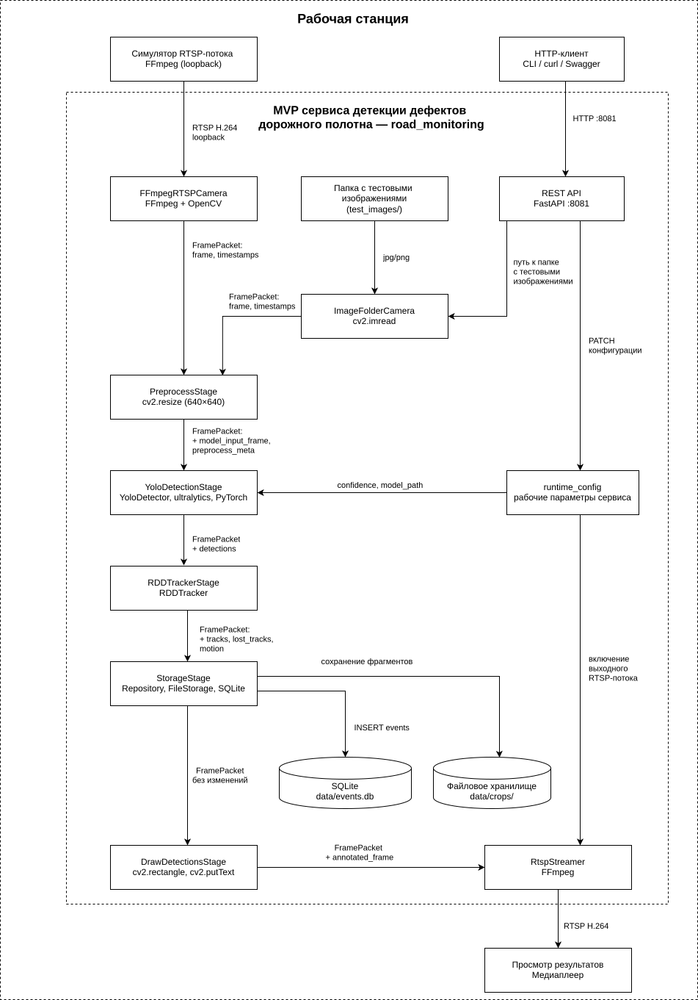
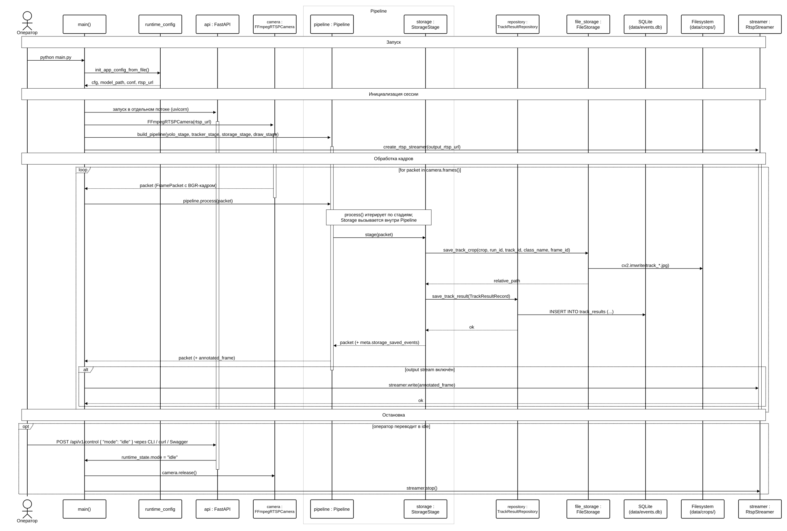

# Детекция дефектов дорожного полотна — MVP


Минимально рабочий прототип сервиса детекции дефектов дорожного полотна с захватом RTSP-видеопотока, трекингом объектов, локальным хранилищем и REST API управления.


---


## Реализованные функции


- Захват входного RTSP-видеопотока (FFmpeg) с автоматическим восстановлением соединения
- Детектирование дефектов моделью YOLO (YOLOv8/v9/v11)
- Трекинг дефектов между кадрами с компенсацией движения камеры (оптический поток Lucas–Kanade)
- Сохранение результатов в локальную SQLite-базу и файловое хранилище кропов
- Трансляция аннотированного выходного RTSP-потока для визуального контроля
- Управление параметрами системы через REST API без перезапуска
- CLI-утилита для настройки и отладки во время работы
- Пакетная обработка директории изображений


---


## Структура репозитория


```text
road_monitoring/
├── main.py                     # Точка входа в приложение
├── config.yaml                 # Конфигурация прототипа
├── requirements.txt            # Зависимости Python-проекта
├── manual_test.ipynb           # Ноутбук для ручной отладки детекций
│
├── api/
│   └── rest_api.py             # REST API (FastAPI, порт 8081)
│
├── core/                       # Ядро системы
│   ├── frame_packet.py         # Датакласс пакета кадра (FramePacket)
│   ├── runtime_config.py       # Runtime-конфигурация
│   └── runtime_state.py        # Текущее состояние системы
│
├── data/                       # Данные, формируемые в ходе работы
│   ├── events.db               # SQLite-база результатов детекции
│   └── crops/                  # Фрагменты изображений дефектов
│       └── run_<id>/
│
├── demo/                       # Скриншоты и видео для документации
│
├── inference/
│   └── yolo_detector.py        # Инференс модели YOLO
│
├── models/                     # Веса моделей (в .gitignore)
│
├── pipeline/                   # Конвейер обработки кадра
│   ├── core.py                 # Базовая логика конвейера
│   └── stages.py               # Стадии конвейера
│
├── sensors/                    # Модули получения видеоданных
│   ├── ffmpeg_camera.py        # Захват RTSP-потока через FFmpeg
│   ├── image_folder_camera.py  # Чтение директории изображений
│   └── rtsp_streamer.py        # Трансляция выходного RTSP-потока
│
├── services/                   # Служебные модули
│   ├── images_batch.py         # Пакетная обработка изображений
│   ├── pipeline_builder.py     # Сборка конвейера
│   └── rtsp_session.py         # Управление RTSP-сессией
│
├── storage/                    # Хранилище данных
│   ├── files.py                # Сохранение изображений (FileStorage)
│   ├── repository.py           # Репозиторий доступа к данным
│   ├── sqlite_db.py            # Инициализация SQLite
│   └── storage_stage.py        # Стадия конвейера сохранения
│
├── tracking/                   # Трекер дефектов RDDTracker
│   ├── rdd_tracker.py          # Основная реализация трекера
│   ├── geometry.py             # Геометрические вычисления
│   ├── matching.py             # Сопоставление детекций и треков
│   ├── models.py               # Внутренние структуры данных
│   ├── motion.py               # Оценка движения (оптический поток)
│   └── tracker_stage.py        # Стадия конвейера трекинга
│
├── scripts2/                              # Скрипты и CLI для управления прототипом
│   ├── 01_start_main_app.sh / .ps1        # Запуск основного приложения main.py
│   ├── 02_cli.sh / .ps1                   # Запуск CLI-утилиты управления
│   ├── 03_start_rtsp_simulator.sh / .ps1  # Запуск симулятора видеокамеры
│   ├── 04_rtsp_view.sh / .ps1             # Просмотр выходного RTSP-потока в mpv
│   ├── scripts_config.yaml                # Общий конфиг скриптов и CLI
│   └── cli/                               # Модули CLI-утилиты
│       ├── __init__.py
│       ├── main.py                        # Точка входа модуля scripts2.cli.main
│       ├── cli.py                         # Меню, обработка ввода, действия
│       ├── api_client.py                  # HTTP-клиент к REST API (stdlib urllib)
│       └── config.py                      # Чтение scripts_config.yaml, пути и URL
│
├── test_images/                # Тестовые изображения
├── test_videos/                # Тестовые видеофайлы
└── dev/                        # Вспомогательные скрипты разработки
```


---


## Диаграмма компонентов  



---


## Диаграмма последовательности режим RTSP 



---


## Системные зависимости


Перед установкой Python-окружения убедитесь, что в системе установлены и доступны в `PATH` следующие программы.


### Python 3.12


Скачать: [python.org/downloads](https://www.python.org/downloads/)


```bash
$ python3.12 --version
Python 3.12.3
```


### ffmpeg


Используется для захвата входного RTSP-потока и публикации тестового видео симулятором камеры.


Скачать: [ffmpeg.org/download](https://ffmpeg.org/download.html)


```bash
$ ffmpeg -version
ffmpeg version 6.1.1-3ubuntu5 Copyright (c) 2000-2023 the FFmpeg developers
```


### Docker


Используется для запуска RTSP-сервера MediaMTX в контейнере. Сам MediaMTX отдельно ставить не нужно — он поднимается автоматически скриптом `03_start_rtsp_simulator`.


Скачать: [docker.com/products/docker-desktop](https://www.docker.com/products/docker-desktop/)
Справка по MediaMTX: [github.com/bluenviron/mediamtx](https://github.com/bluenviron/mediamtx)


```bash
$ docker --version
Docker version 29.4.0, build 9d7ad9f
```


### NVIDIA-драйвер (опционально, для GPU)


Прототип работает и на CPU, но для нормальной производительности рекомендуется GPU с поддержкой CUDA. Если GPU есть — установите NVIDIA-драйвер и убедитесь, что система его видит:


Без GPU производительности на 25–30 кадров/с скорее всего достичь не получится. В этом случае используйте видеофайлы с меньшей частотой кадров или режим пакетной обработки изображений (вызов `POST /api/v1/test/images` или соответствующий пункт меню CLI), где скорость обработки не критична.


Скачать драйвер: [developer.nvidia.com/cuda-downloads](https://developer.nvidia.com/cuda-downloads)

```bash
$ nvidia-smi
+-----------------------------------------------------------------------------------------+
| NVIDIA-SMI 580.159.03             Driver Version: 580.159.03     CUDA Version: 13.0     |
+-----------------------------------------+------------------------+----------------------+
| GPU  Name                 Persistence-M | Bus-Id          Disp.A | Volatile Uncorr. ECC |
|=========================================+========================+======================|
|   0  NVIDIA GeForce RTX 4070 ...    Off |   00000000:01:00.0 Off |                  N/A |
| N/A   43C    P0             15W /  115W |      15MiB /   8188MiB |      9%      Default |
+-----------------------------------------+------------------------+----------------------+
```


Колонка `CUDA Version` в выводе показывает максимально поддерживаемую драйвером версию CUDA — эта цифра пригодится на шаге установки PyTorch.


### mpv (опционально, для просмотра выходного потока)


Нужен только если планируется использовать скрипт `04_rtsp_view` для просмотра выходного RTSP-потока прототипа. Можно пользоваться любым другим RTSP-плеером — тогда установка не требуется.


Скачать: [mpv.io/installation](https://mpv.io/installation/)


```bash
$ mpv --version
mpv 0.38.0 Copyright © 2000-2024 mpv/MPlayer/mplayer2 projects
```


---


## Установка прототипа


### 1 Клонировать репозиторий и перейти в ветку vkr


```bash
git clone https://github.com/userGl/road_monitoring
cd road_monitoring
git checkout vkr
```


### 2 Создать и активировать виртуальное окружение


```bash
# Создать
python3.12 -m venv .venv


# Linux
source .venv/bin/activate


# Windows (PowerShell)
.venv\Scripts\activate
```


### 3 Установить PyTorch


Сборка PyTorch выбирается под версию CUDA, поддерживаемую вашим драйвером (см. колонку `CUDA Version` в выводе `nvidia-smi` из раздела «Системные зависимости»). Подберите нужную команду на [pytorch.org/get-started/locally](https://pytorch.org/get-started/locally/) — там есть селектор ОС, менеджера пакетов и версии CUDA.


Пример для CUDA 12.6:


```bash
pip install torch torchvision --index-url https://download.pytorch.org/whl/cu126
```


Если GPU нет, установите CPU-версию:


```bash
pip install torch torchvision --index-url https://download.pytorch.org/whl/cpu
```


### 4 Установить зависимости проекта


```bash
pip install -r requirements.txt
```


### 5 Скачать веса моделей и тестовое видео


- Веса модели: ссылка в `models/download_link.md`. Скачанный файл поместите в папку `models/`.
- Тестовое видео: ссылка в `test_videos/download_link.md`. Скачанный файл поместите в папку `test_videos/`.


### 6 Проверки перед запуском


Перед стартом убедитесь:


1. **Веса модели** лежат в папке `models/` по пути, указанному в `config.yaml` (параметр `detector.model_path`, по умолчанию `models/YOLOv8_Small_RDD.pt`).
2. **Тестовый видеофайл** существует по пути, указанному в `scripts2/scripts_config.yaml` (параметр `video`, по умолчанию `test_videos/check1.mkv`).
3. **Адреса RTSP согласованы** между конфигурационными файлами (только если что-то было изменено). Через RTSP-сервер идут два потока, для каждого источник публикации и потребитель должны указывать одинаковый адрес:


   - **Входной поток**: симулятор видеокамеры публикует видео по адресу `simulator_*` из `scripts2/scripts_config.yaml`, а прототип читает его из `stream.input_rtsp_url` в `config.yaml`. Эти адреса должны совпадать.
   - **Выходной поток**: прототип публикует аннотированное видео по адресу `stream.output_rtsp_url` из `config.yaml`, а просмотрщик (`04_rtsp_view`) читает его по адресу `output_*` из `scripts2/scripts_config.yaml`. Эти адреса должны совпадать.


   По умолчанию всё уже согласовано, править эти параметры нужно только при смене портов или путей.


### 7 Запуск прототипа


#### 7.1 Запуск приложения прототипа


##### 7.1.1 Linux


Кликните правой кнопкой по `01_start_main_app.sh` в папке `scripts2/` и выберите «Запустить как приложение»:


[Запуск приложения в Linux](demo/start_application_lin3.png)


Возможно предварительно необходимо будет дать права на выполнение скрипта:


[Дать права на выполнение](demo/make_executable.png)


Также приложение можно запустить вручную из активированного виртуального окружения проекта:


```bash
python main.py
```


##### 7.1.2 Windows


Кликните правой кнопкой по `01_start_main_app.ps1` в папке `scripts2/` и выберите «Выполнить с помощью PowerShell»:


[Запуск .ps1 в Windows](demo/start_application_win.gif)


В Windows также приложение можно запустить вручную из активированного виртуального окружения проекта:


```bash
python main.py
```


#### 7.2 Запуск симуляции видеокамеры


В зависимости от операционной системы запустите `03_start_rtsp_simulator.sh` или `03_start_rtsp_simulator.ps1` аналогично пункту 7.1.1 или 7.1.2.


#### 7.3 Запуск просмотра выходного RTSP-потока прототипа


В зависимости от операционной системы запустите `04_rtsp_view.sh` или `04_rtsp_view.ps1` аналогично пунктам 7.1.1 или 7.1.2.


#### 7.4 Демо запуска прототипа


[Запуск MVP Linux](demo/start_mvp.gif)


## Режимы работы MVP


Переключаются через REST API или CLI-утилиту:


| Режим  | Описание                                         |
| ------ | ------------------------------------------------ |
| `rtsp` | Непрерывная обработка входящего RTSP-видеопотока |
| `idle` | Ожидание команды, обработка приостановлена       |


Пакетная обработка директории с тестовыми изображениями вызывается отдельным вызовом REST API (`POST /api/v1/test/images`) или соответствующим пунктом меню CLI.


---


## REST API


Сервер API запускается на http://0.0.0.0:8081/api/v1, адрес и порт заданы в main.py. 


### Конфигурация


#### GET /api/v1/config


Получить текущую конфигурацию.


```json
{
  "stream": { "enable_output_stream": false },
  "detector": {
    "confidence_threshold": 0.05,
    "model_path": "models/YOLOv8_Small_RDD.pt"
  }
}
```


**Пример с curl:**


```bash
curl -X GET "http://localhost:8081/api/v1/config"
```


#### PATCH /api/v1/config


Изменить конфигурацию без перезапуска. Все поля опциональны.


```json
{
  "detector": {
    "confidence_threshold": 0.3,
    "model_path": "models/YOLOv8_Small_RDD.pt"
  },
  "stream": { "enable_output_stream": true }
}
```


**Пример с curl:**


```bash
curl -X PATCH "http://localhost:8081/api/v1/config" \
  -H "Content-Type: application/json" \
  -d '{"detector": {"confidence_threshold": 0.3}, "stream": {"enable_output_stream": true}}'
```


### Управление потоком


#### GET /api/v1/control


Получить текущий статус системы: режим работы, готовность YOLO-стадии.


```json
{
  "mode": "rtsp",
  "yolo_stage_ready": true,
  "test_input_dir": null,
  "test_output_dir": null,
  "test_fps": null
}
```

**Поля ответа:**

- `mode` — текущий режим работы (`rtsp` или `idle`).
- `yolo_stage_ready` — флаг готовности YOLO-детектора. Становится `true` после старта первой сессии обработки (`rtsp` или batch), когда модель загружена в память. Пока флаг `false`, эндпойнт `POST /api/v1/test/detect` возвращает 503, а горячая смена модели/порога через `PATCH /api/v1/config` не имеет эффекта.
- `test_input_dir`, `test_output_dir`, `test_fps` — параметры batch-обработки, заданные клиентом через `POST /api/v1/test/images`. До первого вызова равны null. После вызова возвращают заданные значения, не сбрасываются после завершения обработки.

**Пример с curl:**


```bash
curl -X GET "http://localhost:8081/api/v1/control"
```


#### POST /api/v1/control


Переключить режим работы.


```json
{ "mode": "idle" }
```


**Пример с curl:**


```bash
curl -X POST "http://localhost:8081/api/v1/control" \
  -H "Content-Type: application/json" \
  -d '{"mode": "idle"}'
```


### Тестовые вызовы


#### POST /api/v1/test/images


Запустить пакетную обработку директории изображений.


```json
{
  "input_dir": "test_images/japan",
  "output_dir": "test_images/japan/output_1714550400",
  "fps": 10
}
```


**Пример с curl:**


```bash
curl -X POST "http://localhost:8081/api/v1/test/images" \
  -H "Content-Type: application/json" \
  -d '{"input_dir": "test_images/japan", "output_dir": "test_images/japan/output_1714550400", "fps": 10}'
```


#### POST /api/v1/test/detect


Одиночная детекция по base64-изображению.


**Запрос:**


```json
{
  "image": "<base64-строка JPEG/PNG>",
  "confidence_threshold": 0.3
}
```


**Ответ:**


```json
{
  "success": true,
  "timestamp": "2026-04-01T12:00:00.123456",
  "image_shape": [720, 1280, 3],
  "detections": [
    {
      "class_id": 1,
      "class_name": "D10",
      "confidence": 0.82,
      "bbox": [120.5, 340.2, 280.1, 410.7]
    }
  ],
  "processing_time_ms": 45.3,
  "message": "Обнаружено дефектов: 1"
}
```


**Пример с curl (Linux/macOS):**


```bash
IMAGE_B64=$(python - << 'EOF'
import base64
with open("test_images/08_Japan_003154.jpg", "rb") as f:
    print(base64.b64encode(f.read()).decode())
EOF
)


curl -X POST "http://localhost:8081/api/v1/test/detect" \
  -H "Content-Type: application/json" \
  -d "{\"image\": \"${IMAGE_B64}\", \"confidence_threshold\": 0.3}"
```


---


## CLI-утилита

Для упрощения взаимодействия с прототипом разработана CLI-утилита — интерактивное текстовое меню. Утилита реализует клиентскую часть взаимодействия по эндпойнтам, описанным в разделе REST API: отправляет HTTP-запросы к прототипу, разбирает ответы и отображает результат пользователю

CLI-утилита (`scripts2/cli/`) позволяет управлять параметрами прототипа «на лету»: сменой модели, порога уверенности модели, режима работы, запуском тестовой пакетной обработки изображений.  


Для запуска CLI-утилиты в зависимости от операционной системы запустите `02_cli.sh` или `02_cli.ps1` аналогично пунктам 7.1.1 или 7.1.2. Утилиту можно запустить также из активированного виртуального окружения проекта:

```bash
python -m scripts2.cli.main
```

При запуске утилита считывает настройки IP/порта API, хранящиеся в `scripts2/scripts_config.yaml`, и управляет работой прототипа по протоколу REST API. Также утилита считывает содержимое папок `models/` и `test_images/` и выводит список доступных dtcjd моделей и директорий с тестовыми изображениями. При недоступности REST API утилита выводит сообщение «MVP-приложение не запущено или недоступно» и возвращается в меню, не завершая работу.  

### Cтруктура меню

```
CLI (scripts2.cli.main)
│
└── Главное меню
    │
    ├── Управление MVP:
    │   ├── 1) Выбрать файл весов модели ИНС   → PATCH /api/v1/config
    │   ├── 2) Изменить порог уверенности      → PATCH /api/v1/config
    │   ├── 3) Вкл/выкл выходной видеопоток    → PATCH /api/v1/config
    │   ├── 4) Переключить режим RTSP / IDLE   → POST  /api/v1/control
    │   └── 5) Показать текущую конфигурацию   → GET   /api/v1/config
    │
    ├── Тесты:
    │   └── 6) Batch-обработка изображений     → POST  /api/v1/test/images
    │
    └── 0) Выход
```
### Демонстрация работы CLI  

<video src="demo/cli.mp4" controls width="1280"></video>

---

## Хранилище данных

Прототип сохраняет два вида артефактов: метаданные подтверждённых треков (SQLite) и кропы — фрагменты исходного кадра с дефектом (файловая система). За запись отвечает стадия конвейера `StorageStage`, которая получает на вход `FramePacket` с полем `lost_tracks` (треки, завершившие жизнь в трекере) и сохраняет только те из них, у которых `confirmed=True`.

### Местоположение данных

| Артефакт | Путь | Описание |
| --- | --- | --- |
| База данных | `data/events.db` | Метаданные всех сохранённых треков |
| Кропы | `data/crops/run_<run_id>/track_<track_id>_frame_<frame_id>.jpg` | Изображения «лучшего» кадра трека |

Имя файла БД задано в `services/rtsp_session.py` и `services/images_batch.py`. Папка с кропами создаётся автоматически при первой записи.

### Идентификатор запуска `run_id`

Каждая сессия обработки получает уникальный `run_id`. В текущей реализации в качестве идентификатора используется Unix-timestamp момента старта (`int(time.time())`). Один `run_id` соответствует:

- одной непрерывной RTSP-сессии (от перехода в режим `rtsp` до выхода в `idle`)
- одному вызову пакетной обработки `POST /api/v1/test/images`

Это позволяет отделять результаты разных запусков друг от друга в общей БД и в файловой структуре `data/crops/run_<run_id>/`.

### Схема таблицы `track_results`

Все подтверждённые треки сохраняются в одну таблицу. Уникальность гарантируется парой `(run_id, track_id)` — при повторной записи того же трека выполняется `UPDATE` через `ON CONFLICT`.

| Колонка | Тип | Описание |
| --- | --- | --- |
| `id` | INTEGER PK | Автоинкрементный первичный ключ |
| `run_id` | INTEGER | Идентификатор запуска |
| `track_id` | INTEGER | Идентификатор трека внутри запуска |
| `class_id` | INTEGER | Числовой идентификатор класса дефекта |
| `class_name` | TEXT | Имя класса дефекта (например, «D10») |
| `last_bbox_x1/y1/x2/y2` | REAL | Координаты последней наблюдённой рамки |
| `best_bbox_x1/y1/x2/y2` | REAL nullable | Координаты «лучшего» кадра трека (максимальная уверенность) |
| `best_confidence` | REAL | Максимальная уверенность детектора в треке |
| `best_frame_id` | INTEGER nullable | Номер кадра, на котором достигнут максимум уверенности |
| `last_seen_frame` | INTEGER | Номер последнего кадра, где трек наблюдался |
| `age` | INTEGER | Возраст трека (число кадров жизни) |
| `confirmed` | INTEGER | Подтверждение трека (0/1) |
| `crop_path` | TEXT nullable | Относительный путь к файлу кропа от `data/` |
| `crop_width`, `crop_height` | INTEGER nullable | Размеры сохранённого кропа в пикселях |
| `created_at` | DATETIME | Время вставки записи |

Индексы:

- `idx_track_results_run_track` — на пару `(run_id, track_id)`
- `idx_track_results_class_name` — на `class_name` (быстрая выборка по типу дефекта)

### Просмотр содержимого БД

База соответствует обычному файлу SQLite — открывается любой совместимой утилитой без запущенного прототипа.

Командная строка:

```bash
sqlite3 data/events.db ".schema track_results"
sqlite3 data/events.db "SELECT run_id, COUNT(*) FROM track_results GROUP BY run_id;"
sqlite3 data/events.db "SELECT track_id, class_name, best_confidence, crop_path \
                       FROM track_results WHERE run_id = <RUN_ID> ORDER BY best_confidence DESC LIMIT 20;"
```

GUI-утилиты: [DB Browser for SQLite](https://sqlitebrowser.org/), [DBeaver](https://dbeaver.io/), плагин SQLite Viewer для VS Code.

Python:

```python
import sqlite3
conn = sqlite3.connect("data/events.db")
conn.row_factory = sqlite3.Row
for row in conn.execute("SELECT * FROM track_results WHERE class_name = ? LIMIT 5", ("D10",)):
    print(dict(row))
```

### Связь записи и кропа

В колонке `crop_path` хранится путь относительно директории `data/`. Чтобы получить абсолютный путь к файлу-кропу, объедините `data/` и значение `crop_path`. В коде это делает `FileStorage.build_absolute_path(relative_path)`.

Пример: запись с `crop_path = "crops/run_001714550400/track_000017_frame_001234.jpg"` соответствует файлу `data/crops/run_001714550400/track_000017_frame_001234.jpg`.

### Сброс данных

База инициализируется через `CREATE TABLE IF NOT EXISTS`, поэтому при повторных запусках накопленные данные сохраняются. Для полной очистки удалите файл базы и папку кропов:

```bash
rm -rf data/events.db data/crops/
```

При следующем запуске прототип создаст пустую базу и пустую директорию кропов автоматически.

## Конфигурация

### config.yaml — параметры прототипа


| Параметр                        | Значение по умолчанию           | Описание                     |
| ------------------------------- | ------------------------------- | ---------------------------- |
| `stream.input_rtsp_url`         | `rtsp://127.0.0.1:8554/live`    | Адрес входного RTSP-потока   |
| `stream.output_rtsp_url`        | `rtsp://127.0.0.1:8554/preview` | Адрес выходного RTSP-потока  |
| `stream.enable_output_stream`   | `false`                         | Включить выходную трансляцию |
| `detector.model_path`           | `models/YOLOv8_Small_RDD.pt`    | Путь к весам модели          |
| `detector.confidence_threshold` | `0.05`                          | Порог уверенности детектора  |


Параметры могут быть изменены через REST API во время работы без перезапуска.


### scripts2/scripts_config.yaml — параметры скриптов и CLI


| Параметр           | Значение по умолчанию      | Описание                                                              |
| ------------------ | -------------------------- | --------------------------------------------------------------------- |
| `mvp_control_ip`   | `127.0.0.1`                | IP-адрес REST API прототипа (используется CLI)                        |
| `mvp_control_port` | `8081`                     | Порт REST API прототипа (используется CLI)                            |
| `video`            | `test_videos/check1.mkv`   | Путь к видеофайлу, публикуемому симулятором камеры                    |
| `simulator_host`   | `127.0.0.1`                | Хост входного RTSP-потока симулятора                                  |
| `simulator_port`   | `8554`                     | Порт входного RTSP-потока симулятора                                  |
| `simulator_path`   | `live`                     | Путь (mount point) входного RTSP-потока симулятора                    |
| `output_host`      | `127.0.0.1`                | Хост выходного RTSP-потока прототипа (для просмотра в mpv)            |
| `output_port`      | `8554`                     | Порт выходного RTSP-потока прототипа                                  |
| `output_path`      | `preview`                  | Путь (mount point) выходного RTSP-потока прототипа                    |


---